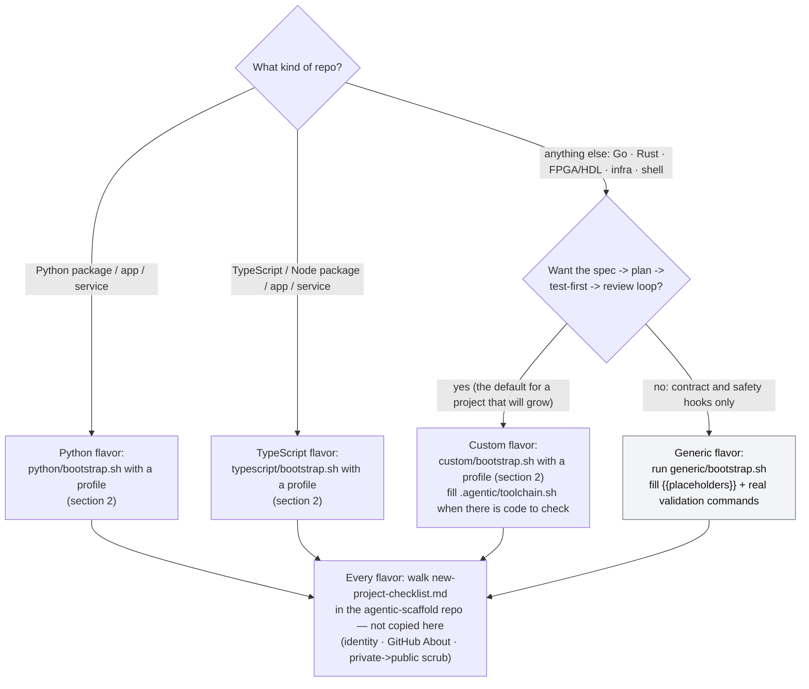
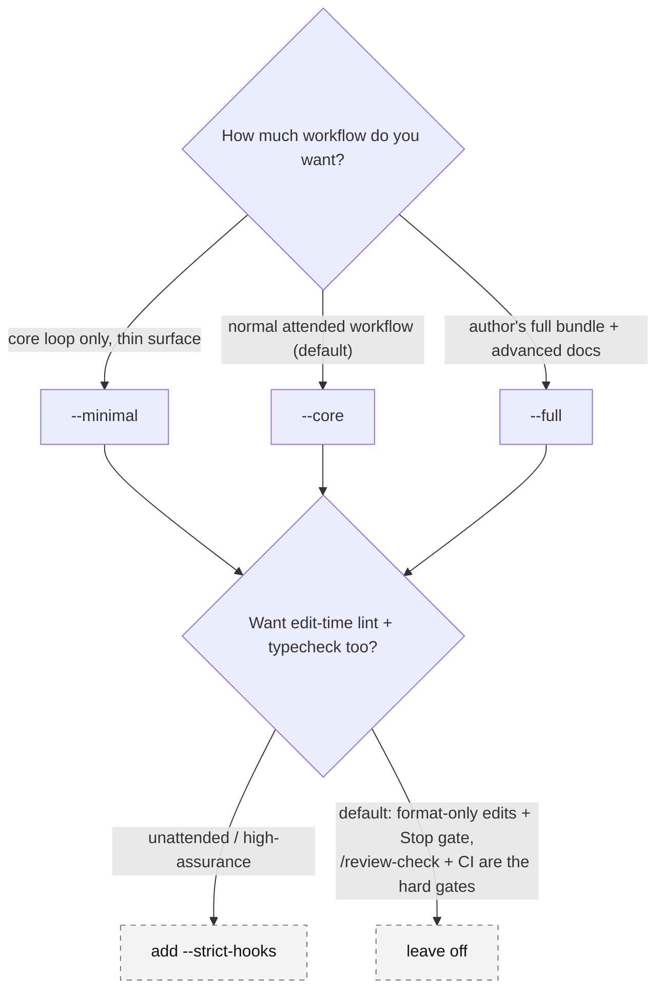
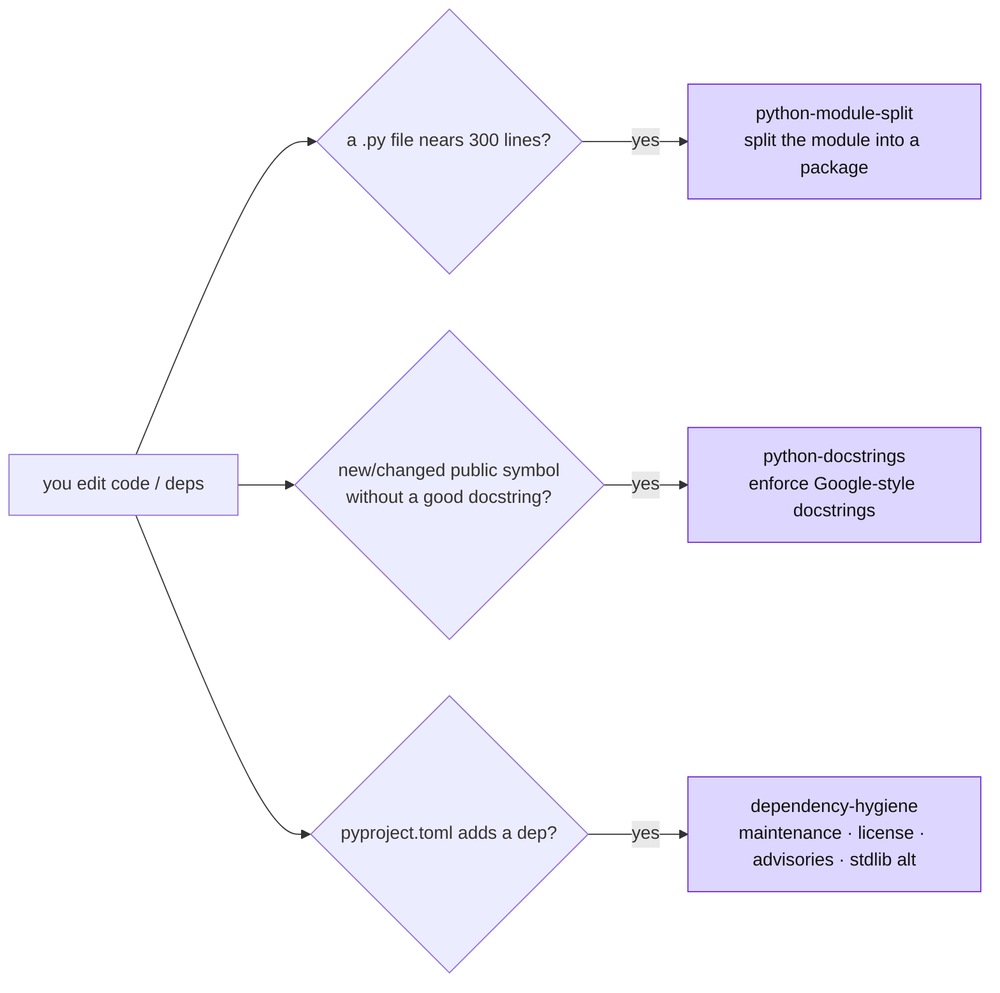

# Project types, profiles, and when to use each piece

> **Purpose.** The orientation map for someone new to this scaffolding.
> Answers three questions: *which project type do I pick*, *what did that
> give me*, and *when do I run each agent / skill / command*. For the
> **shape** of the loop see [`workflow-diagram.md`](workflow-diagram.md);
> for the **steps** in order see [`../WORKFLOW.md`](../WORKFLOW.md); for the
> **rules** every client follows see [`../AGENTS.md`](../AGENTS.md); for
> Codex startup and switching see [`codex-cli.md`](codex-cli.md).

A stack flavor (Python, TypeScript, custom) standardizes a five-phase loop —
`Spec -> Plan -> Test-first -> Implement -> Verify` — and its profiles
change how much scaffolding surrounds that loop. The loop is the same in
every stack; what differs is the toolchain behind `.agentic/toolchain.sh`,
the one file that names the stack's formatter, linter, type checker, and
test runner. Python and TypeScript ship that file filled in. The custom
stack ships it as a template the project fills, so a repository with no
adapter still gets the loop. The generic flavor installs no loop at all: it
standardizes the multi-client contract and safety layer and leaves workflow
and validation to the repository owner.

---

## 1. Pick a flavor



The **custom flavor** is the full loop for a stack with no adapter: every
command, role, hook, and rule the Python and TypeScript flavors ship, with
`.agentic/toolchain.sh` as a project-owned template instead of a filled
runner. While `TC_CONFIGURED=0`, `ready` exits 3 and the Stop gate, the
edit hook, and CI's quality job stay quiet, so a research or feasibility
phase runs on `/spec`, `/plan`, and `/review` alone. The first spec that
adds code to check fills the runner and sets `TC_CONFIGURED=1`. From then
on, configuration errors fail the gate instead of skipping it. Run:

```bash
bash path/to/agentic-scaffold/custom/bootstrap.sh
```

The **generic flavor** installs one canonical `AGENTS.md` contract with a
Claude import shim, Claude/Codex/Pi configuration, stack-neutral safety hooks,
Codex command rules, and a Codex startup guide. It has no formatter, Stop
gate, workflow skills, custom agents, or CI because those choices depend on
the actual stack. Run:

```bash
bash path/to/agentic-scaffold/generic/bootstrap.sh
```

Fill its validation section with the repository's real commands. Pick it
for a repository that will not run the loop: dotfiles, a notes or docs
repository, a one-script utility. It installs no `WORKFLOW.md`; its day
zero is the "After bootstrap" list in the scaffold's `generic/README.md`.
A project that expects specs and reviews takes the custom flavor instead,
even before it has chosen its tools.

The rest of this document is about the **stack flavors**, where the
prescribed workflow surface lives. Choose the language for the project, not
for the scaffold: every stack flavor ships the same loop, hooks, gate, and
CI shape. A language with no `stacks/<name>/` adapter yet gets the custom
flavor until one is added (the scaffold's `docs/multi-stack-scaffold.md`
lists what an adapter supplies).

### Choosing the stack from a project description

The founding conversation happens before anything is installed, so the
agent reads this rubric from the scaffold checkout.

**Interview before deciding.** A rough idea is a normal starting point.
When the description does not answer the rubric, run the product-spec
interview first (`workflow/commands/product-spec.md` in the checkout: seven
questions, one at a time, push back once on a vague answer, then record
the unknown rather than invent certainty). Its sixth question, constraints,
is where the runtime and platform usually surface. After the bootstrap,
write the answers to `docs/specs/0000-product.md`, the file `/product-spec`
would have produced. Ask the rubric questions in order; the first one with
a decisive answer wins, and one the answers cannot settle is a question to
the human, not a guess.

**What is not decided on day zero.** Only the stack. Storage, API shape,
auth model, sync/async boundaries, and similar cross-cutting choices wait
for the first feature that needs them and are recorded with `/adr` then,
with the alternatives considered. Deciding them from a thin description
would produce a plausible architecture for a project that does not exist
yet.

| Ask | Decides for | Example |
| --- | --- | --- |
| **Where must it run?** A browser, a Node-hosted platform, a Python-hosted platform, or a single static binary each name a language. | The runtime's language | Browser extension or Cloudflare Worker: TypeScript. Airflow DAG or Jupyter tooling: Python. |
| **Which ecosystem has the libraries it needs?** | The ecosystem's language | ML, data, scientific: Python. Web front end, Node tooling: TypeScript. |
| **How much should the compiler catch?** Long-lived services with many contributors, or code the agent will write mostly unattended, benefit from a strict type checker in the Stop gate. | TypeScript strict, or Python with mypy strict | Both stacks run a type checker in the gate; TypeScript's is the compiler itself. |
| **Does a stack adapter exist?** | `stacks/<name>/` present; otherwise the custom flavor, or generic for a repository that will not run the loop | Go, Rust, and FPGA/HDL have no adapter; they take the custom flavor and fill the runner. |
| **Tie?** | The owner's review fluency | Python here: review is where a human's reading speed pays, and the loop makes the agent's language weakness moot either way. |

Do not choose from benchmark rankings of agent skill by language; those
orderings change with the model and the task (the scaffold's
`docs/multi-stack-research.md`, finding 2). State the choice and the
deciding question in the project's `AGENTS.md` description so the next
session does not re-derive it.

---

## 2. Pick a profile

`bootstrap.sh` installs one of three profiles. The default is
`--core` (`--python-core` is still accepted for projects bootstrapped before
the rename). Options compose on top of any profile:
`--strict-hooks` (enforce lint/type-check on every edit),
`--no-stop-gate` (remove the default turn-end gate), and
`--advanced-docs` (add the deeper doctrine docs without going full).
Use `--default-hooks` to return a project from either non-default hook
mode to format-only edits plus the Stop gate, and `--no-advanced-docs`
to clear a previously persisted advanced-docs option.



| Profile | Who it is for | One-line summary |
| --- | --- | --- |
| `--minimal` | A small repo that wants the core loop without the full doctrine surface | Claude commands + portable Codex/Pi skills + Pi prompts, all clients' core roles, shared safety hooks, rules, specs convention, CI |
| `--core` (default) | The normal attended agentic workflow | Minimal + the stack's skills, ADRs, the sharpening commands, status dashboard, workflow diagram, Dependabot |
| `--full` | The author's complete workflow bundle | Core + advanced docs (parallel agents, plugin path, serena, evals) + optional-reviewer command stubs |

Grow or shrink later: `bootstrap.sh --update --full` promotes a project,
while an explicit smaller profile prunes files that are both excluded and
still match their recorded scaffold checksum. Customized excluded files are
preserved with a warning. Project-owned files (`AGENTS.md`, the stack's
manifest and tool configs, `README.md`, `.gitignore`) are never overwritten
wholesale; Claude reads the
canonical `AGENTS.md` through the scaffold-managed `CLAUDE.md` import shim.

Bootstrap records the selected profile, hook mode, advanced-docs option, and
managed-file checksums under `.agentic/`. A flagless `bootstrap.sh --update`
reuses those choices. Updates also checksum-protect `.claude/settings.json`,
`.codex/config.toml`, `.codex/hooks.json`, and `.pi/settings.json`: unchanged
scaffold copies
receive template improvements, while project-customized copies remain intact
for a manual merge.

---

## 3. What each profile installs

Read top-down: everything in a tier includes the tiers above it.

### Core — every profile, including `--minimal`

- **Context:** canonical `AGENTS.md` plus Claude's `@AGENTS.md` import shim
- **Workflows:** Claude and Pi `/spec`, `/plan`, `/test-first`,
  `/review-check`, `/review`; equivalent Codex `$spec`, `$plan`,
  `$test-first`, `$review-check`, `$review`. Pi can also invoke the portable
  skills as `/skill:<name>`.
- **Agents:** Claude Markdown, Codex TOML, and Pi Markdown adapters for
  `planner`, `test-first`, `reviewer`
- **Hooks:** `branch-check` (warn on `main`), `block-destructive`
  (deny unrecoverable Bash), `specs-status` (refresh the spec dashboard),
  `gate-on-stop` (block turn-end while the source tree is dirty and
  `.agentic/toolchain.sh gate` is red — remove with `--no-stop-gate`),
  `strip-ai-attribution` (commit-msg backstop); default settings run
  `.agentic/toolchain.sh format` on edit
- **Gate runner:** `.agentic/toolchain.sh` — the one file naming the stack's
  tools (Python: ruff, mypy, pytest; TypeScript: Biome, tsc, Vitest; custom:
  a project-owned template, quiet until filled); hooks, `/review-check`, and
  CI call its subcommands
- **Rules:** git-workflow, commit-style, public-repo-hygiene,
  external-reference-provenance, agent-legible-code, plus the stack's code
  conventions (`python-code` or `typescript-code`; the custom stack keeps
  its conventions and test-first notes in the contract's project-owned
  Stack section, so `--update` does not overwrite them)
- **Convention + CI:** `docs/specs/README.md`, `.github/workflows/ci.yml`
  (the four gate steps through the runner, plus a dependency audit; the
  custom stack's is project-owned, runs the gate once the runner is filled,
  and ships no audit job), PR template, issue forms, `.pre-commit-config.yaml`
- **Codex:** `.codex/config.toml`, trusted hooks, command rules, and
  `docs/codex-cli.md`
- **Pi:** `.pi/settings.json`, project prompts and roles, the local lifecycle
  extension, exact-pinned extension-only `pi-subagents`, and `docs/pi-agent.md`

### Added by `--core` (the default)

- **Workflows:** Claude and Pi `/product-spec`, `/scope-check`, `/clarify`,
  `/adr`, `/analyze`, `/specs-status`, `/review-adversarial`; Codex uses the
  same names with `$`
- **Agents:** `analyzer`, `reviewer-adversarial`
- **Skills (auto-fire, section 5):** the stack's skills — Python ships
  `python-module-split`, `python-docstrings`, `dependency-hygiene`;
  TypeScript ships none yet
- **Docs:** `docs/adr/README.md`, `docs/workflow-diagram.md`,
  `docs/agent-handoff.md`
- **Automation:** `.github/dependabot.yml`

### Added by `--full` (or `--advanced-docs` for the docs only)

- **Docs:** `docs/parallel-agents.md`, `docs/plugin-packaging.md`,
  `docs/serena-setup.md`, `docs/evals.md`, `docs/llm-product.md`,
  `docs/local-executor.md`
- **Workflows (`--full` only):** Claude and Pi `/security`, `/performance`,
  `/eval`, `/delegate` and matching Codex `$` skills (the first three are
  stubs — each requires its opt-in agent, below)
- **Workflow (`--full` only):** `.github/workflows/claude-review.yml.example`

### Added by `--strict-hooks` (any profile)

- Claude and Codex hook wiring plus Pi's shared scaffold state are selected
  so edits run
  `.agentic/toolchain.sh format` + `lint` + `typecheck`
  (the Stop gate is already on by default; `--strict-hooks` keeps it and
  is incompatible with `--no-stop-gate`; select `--default-hooks` to return
  to the default mode on a later update).

### Opt-in agents — never auto-copied, manual per project (section 6)

- `security-reviewer`, `performance-reviewer`, `evaluator` — copy the
  `.claude/agents/optional/`, `.codex/agents/optional/`, and
  `.pi/agents/optional/` adapters only
  when the project's surface warrants it.

---

## 4. When to run each agent and command

The loop's five phases are fixed; these are the tools that drive them plus
the optional sharpening passes. "Profile" is the thinnest profile that
ships the workflow. The table uses the `/<name>` notation shared by Claude
and Pi; Codex uses the same name as `$<name>`.

| Run this | It does | Reach for it when | Profile |
| --- | --- | --- | --- |
| `/spec` | Writes `docs/specs/NNNN-*.md` — drafts goal/success/non-goals from the current discussion, or a skeleton to fill; stops for your review | Any non-trivial feature — the source of truth | minimal |
| `/plan` (`planner`) | Read-only file-by-file plan | Medium or larger work, or the approach is unclear | minimal |
| `/test-first` (`test-first`) | Writes failing tests from the spec, in the stack's test runner | Before writing any implementation code | minimal |
| `/review-check` | Local gate through `.agentic/toolchain.sh`: lint · format · typecheck · test | Before `/review` and before commit | minimal |
| `/review` (`reviewer`) | Fresh-context diff review vs the spec | After the gate is green, before commit | minimal |
| `/product-spec` | Interview -> `docs/specs/0000-product.md` | Backlog outgrows your head, or before a multi-spec autonomous run | core |
| `/scope-check` | Five forcing questions | The goal is fuzzy, before `/spec` | core |
| `/clarify` | Interrogates a draft spec, writes answers back | The spec has real unknowns, after your first edit | core |
| `/adr` | Records a cross-cutting technical decision | Large work with a choice costly to reverse | core |
| `/analyze` (`analyzer`) | Read-only spec ↔ tests ↔ diff consistency check | Want proof tests cover the spec before implementing | core |
| `/review-adversarial` (`reviewer-adversarial`) | Argues *against* the diff | Meaningful PRs — pair with `/review` for A/B | core |
| `/specs-status` | Refreshes + prints the spec dashboard | Any time you want the backlog at a glance | core |
| `/security` (`security-reviewer`) | App-sec-only review | The diff touches a trust boundary (section 6) | full + opt-in agent |
| `/performance` (`performance-reviewer`) | Perf-only review | The diff touches a hot path (section 6) | full + opt-in agent |
| `/eval` (`evaluator`) | Authors/runs an LLM output-quality eval | The product ships an LLM/AI surface (section 6) | full + opt-in agent |
| `/delegate` | Builds a self-contained handoff packet for a weaker/local executor | Handing one already-tested file to a local model ([`local-executor.md`](local-executor.md)) | full |

Two hard rules survive every profile: **CI is the gate you cannot skip**,
and **you write the commit message** — the agent never commits for you.

The planning artifacts nest broad to narrow — **product spec (PRD) -> ADR
-> spec** — and each has its own authoring flow in
[`../WORKFLOW.md`](../WORKFLOW.md) → "The planning artifacts, broad to
narrow":

- **Product spec (PRD)** — `/product-spec` interviews you; use it when the
  backlog outgrows your head. Standing context the rest link up to.
- **ADR** — write it yourself or discuss then have `/adr` draft it; use it
  for a cross-cutting technical decision costly to reverse (Large work).
- **Spec** — write it yourself, discuss then have `/spec` draft it, or let
  `/scope-check` + `/clarify` interview you. The everyday artifact.

A hierarchy, not a pipeline: most features are just product context ->
spec, with no ADR.

---

## 5. When each skill auto-fires

These reusable skills normally load on their own when the diff trips a
trigger. They can also be selected explicitly from the client's skill
picker. They ship with `--core` and `--full`. Skills are per stack; the
Python stack ships the three below, and other stacks add theirs on field
evidence rather than by symmetry.



| Skill | Fires when | What it enforces |
| --- | --- | --- |
| `python-module-split` | A `.py` file approaches ~300 lines | Split into a package, preserve the public API |
| `python-docstrings` | A new/changed public symbol lacks a compliant docstring | Google-style docstrings on public functions/classes/modules |
| `dependency-hygiene` | `pyproject.toml` gains a dependency | Screen maintenance, license, advisories, and stdlib alternatives before it lands |

---

## 6. Special project surfaces (opt-in)

These are cross-cutting properties of a project, not profiles. Decide them
at day zero (see the day-zero diagram in
[`workflow-diagram.md`](workflow-diagram.md)) and enable only what applies.
The reviewer agents have optional adapters under each client's directory;
copy all three files and add a one-line mention in `AGENTS.md`.

| Your project has… | Enable | When to skip | Reference |
| --- | --- | --- | --- |
| A network surface, auth, untrusted input, secrets, or external deserialization | `security-reviewer` + `/security` | Pure-local tooling with no trust boundary | agent header |
| A hot path, DB queries on user-sized data, async, or a latency SLO | `performance-reviewer` + `/performance` | Nothing runs under load | agent header |
| A product LLM/AI surface (summarizer, RAG, chatbot, agent trajectory, NL classifier) | `evaluator` + `/eval`; build to the [`llm-product.md`](llm-product.md) conventions | Deterministic product — tests suffice | [`evals.md`](evals.md) · [`llm-product.md`](llm-product.md) |
| A large, long-lived repo where the agent re-maps structure every session | `serena` MCP | Fresh or small repo — grep is enough | [`serena-setup.md`](serena-setup.md) |
| Two+ features independent at the file level, or a long unattended run | Worktrees / completion ladder | You are at the keyboard on one feature | [`parallel-agents.md`](parallel-agents.md) |

`evals.md`, `llm-product.md`, `serena-setup.md`, `parallel-agents.md`, and
`local-executor.md` install with `--full` or `--advanced-docs`. The optional agents themselves are always
available in the scaffold's `.claude/agents/optional/` and
`.codex/agents/optional/`, whatever profile you installed.

---

## Where to go next

- [`workflow-diagram.md`](workflow-diagram.md) — the loop as diagrams:
  day zero, the per-feature loop, the automation layer, "scale to the task."
- [`../WORKFLOW.md`](../WORKFLOW.md) — the steps in order, one line of why each.
- [`../AGENTS.md`](../AGENTS.md) — the complete rules every client follows.
- [`pi-agent.md`](pi-agent.md) — Pi trust/reload, project prompts and roles,
  model portability, and known enforcement gaps.
- [`codex-cli.md`](codex-cli.md) — Codex trust, invocation, switching, and
  non-interactive use.
- [`specs/README.md`](specs/README.md) — spec numbering, the opt-in issue mode,
  the product spec, section shapes.
