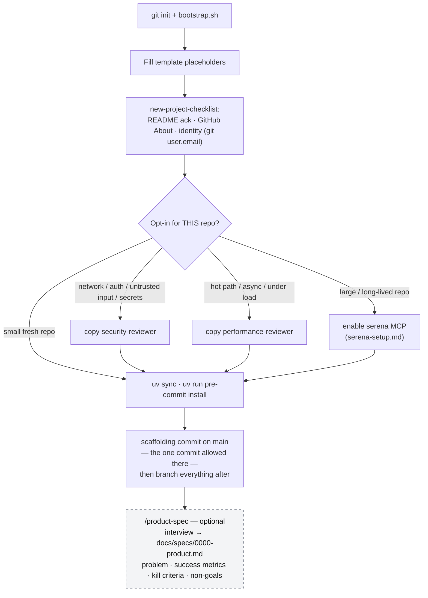
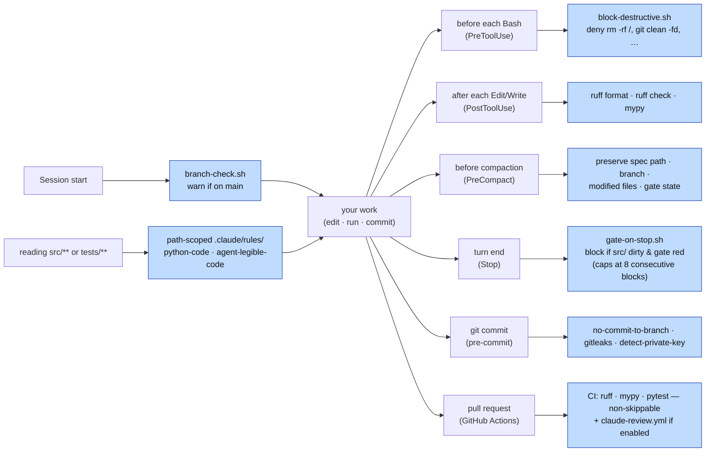
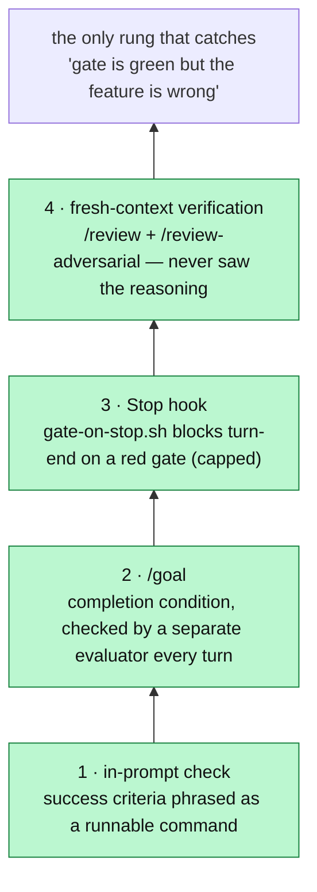
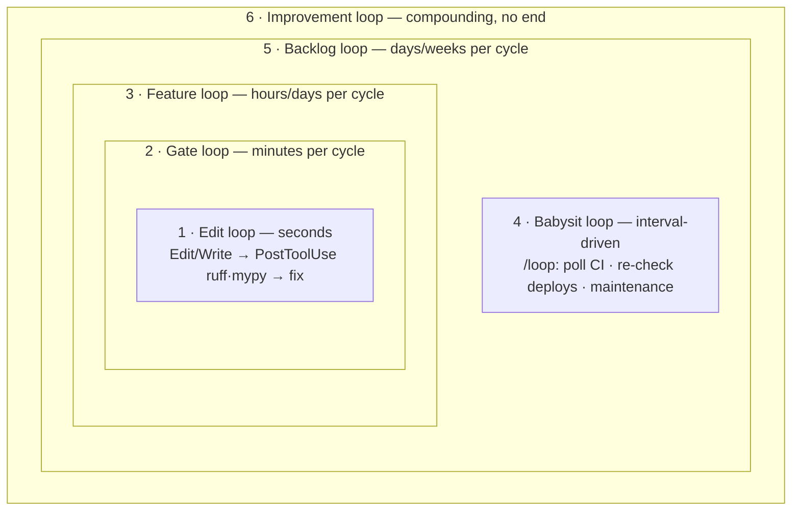
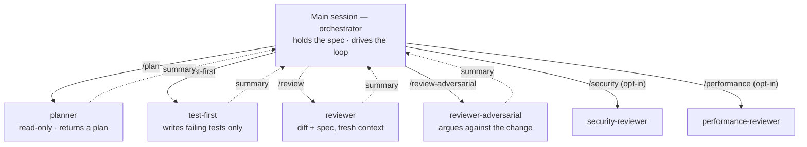
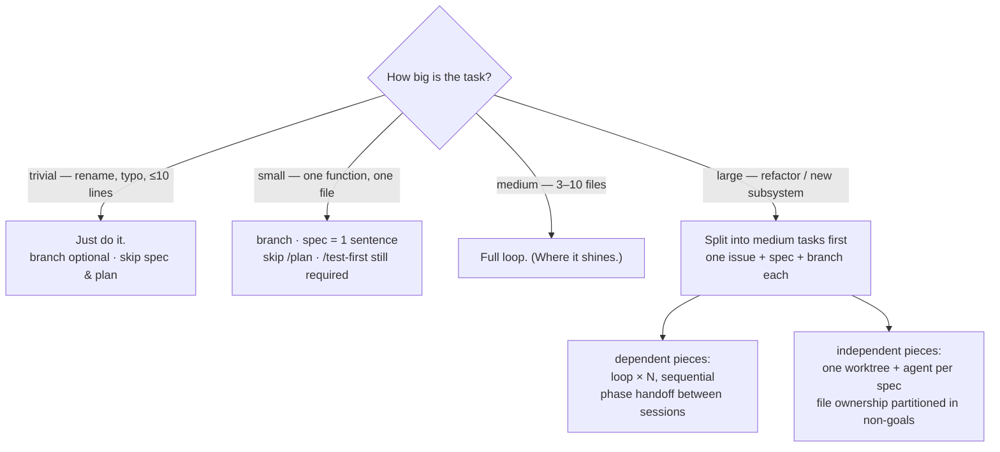
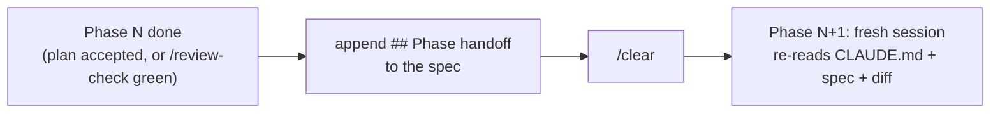

# Agentic workflow — visual map

> **Purpose.** The visual / systems companion to the methodology.
> `../CLAUDE.md` is the *rules* the agent follows every turn;
> [`../WORKFLOW.md`](../WORKFLOW.md) is the prose *walkthrough* — what each
> step is for and where it goes wrong if you skip it. This file is the
> *map*: how the spec, branch, slash commands, subagents, hooks, and CI
> fit together, in diagrams. Read WORKFLOW.md for the *why*; read this to
> see the *shape*.
>
> Diagrams are [Mermaid](https://mermaid.js.org/) — they render natively on
> GitHub and in Obsidian (VS Code needs the "Markdown Preview Mermaid
> Support" extension), and degrade to readable source everywhere else. This
> doc is generic scaffolding; nothing here is project-specific.

---

## Three actors

The loop has three actors, and most of the design is about keeping them in
their lanes:

- **You** — drive the loop, own the two checkpoints, write the spec and
  the commit message. The agent never commits for you.
- **The agent** (main session) — the *orchestrator*: holds the spec, runs
  each phase, delegates focused work to subagents to keep its own context
  clean.
- **Automation** — hooks and CI that fire on their own (on edit, on
  turn-end, on commit, on PR) so discipline doesn't depend on memory.

The diagrams below colour these where it helps: **★ checkpoints** are
yours, **gates** are automated, **subagents** run in fresh context.

---

## Day zero (once per project)

The identity check is load-bearing: `git config user.email` is baked into
the first commit forever and leaks once the repo flips public. Opt-ins are
decided *now*, not retroactively — see [`../WORKFLOW.md`](../WORKFLOW.md)
"Day zero."

`/product-spec` is the product-level layer — the job a PRD does on a
team. It interviews you (seven questions, one at a time) and writes
`docs/specs/0000-product.md` from the answers; feature specs link up to
it instead of restating product rationale. Optional on day one — a
README purpose paragraph covers a small project — but write it before
the backlog outgrows your head or before any multi-spec autonomous run.

---

## The per-feature loop

The core. Each box is a separate turn; the agent stops and surfaces output
at transitions rather than rolling forward.

```mermaid
flowchart TD
    S0["/scope-check — optional<br/>5 forcing questions"] --> ISS["Create the issue: gh issue create<br/>issue # becomes NNNN"]
    ISS --> S1["/spec → docs/specs/NNNN-*.md<br/>NNNN = issue # (identity, not order)"]
    S1 --> EDIT["Edit spec: goal · success · non-goals<br/>+ Depends on: NNNN if blocked"]
    EDIT --> CLAR["/clarify — optional<br/>interrogates the draft spec, ≤5 questions<br/>writes answers back into it"]
    CLAR --> BR["Create branch: issue#-slug<br/>never on main"]
    BR --> PLAN["/plan → planner subagent (read-only)"]
    PLAN --> CP1{"★ Plan looks right?"}
    CP1 -->|no| FIXSPEC["Fix the spec / push back"]
    FIXSPEC --> EDIT
    CP1 -->|yes| TF["/test-first → failing tests"]
    TF --> REDOK{"Fails for the right reason?"}
    REDOK -->|"no — ImportError / typo"| TF
    REDOK -->|"yes — Assertion / NotImplemented"| AN["/analyze — optional<br/>spec ↔ tests cross-check:<br/>every criterion covered?"]
    AN -->|coverage hole| TF
    AN --> IMPL["Implement — main session, on branch"]
    IMPL --> GATE["/review-check<br/>ruff · format · mypy · pytest"]
    GATE --> GREEN{"Green?"}
    GREEN -->|no| IMPL
    GREEN -->|yes| CP2{"★ Checkpoint before review"}
    CP2 --> REV["/review + /review-adversarial<br/>independent subagents"]
    REV --> OPT["/security · /performance<br/>if installed & triggered"]
    OPT --> APP{"Approved?"}
    APP -->|no| IMPL
    APP -->|yes| COMMIT["Commit — you write the message"]
    COMMIT --> PR["gh pr create --fill --web<br/>body: Closes #N"]
    PR --> CI["CI: ruff · mypy · pytest<br/>+ Claude PR review if enabled"]
    CI --> CIQ{"CI green?"}
    CIQ -->|no| IMPL
    CIQ -->|yes| MERGE["Merge → issue auto-closes → next /spec"]

    classDef checkpoint fill:#fde68a,stroke:#b45309,color:#111;
    classDef gate fill:#bbf7d0,stroke:#15803d,color:#111;
    classDef subagent fill:#ddd6fe,stroke:#6d28d9,color:#111;
    classDef optional fill:#f3f4f6,stroke:#6b7280,color:#111,stroke-dasharray: 5 5;
    class CP1,CP2 checkpoint;
    class GATE,CI gate;
    class PLAN,TF,REV,OPT subagent;
    class S0,CLAR,AN optional;
```

Dashed boxes are **optional sharpening passes** — skip them when the
answer is already obvious: `/scope-check` when the *goal* is fuzzy,
`/clarify` when the *spec draft* has real unknowns, `/analyze` when you
want proof the tests cover the spec before implementation starts. Each
sits at the point where its class of mistake is cheapest to fix.

**The front of the loop is issue-first.** The GitHub issue exists
before `/spec` runs; its number names the spec, the branch, and the
PR's `Closes #N`. The number is an identifier, not an execution order —
specs ship in whatever order triage dictates, a blocked spec records
`**Depends on:** NNNN` in its header, and `/specs-status` marks it
`(blocked)` until the dependencies ship. See
[`specs/README.md`](specs/README.md) → "Numbering".

**The two ★ checkpoints are the whole point of "autodrive."** When handed
a spec, the agent runs branch → `/test-first` → implement → `/review-check`
on its own, stopping only at: (1) after `/plan`, before tests, and (2)
after `/review-check` is green, before review/commit. A wrong turn at the
spec is a one-paragraph fix; the same error caught at review is a redo.

The back-edges matter: a failing gate or a rejected review returns to
**Implement**, not to the start — but a *wrong plan* returns to the
**spec**, because the plan being wrong usually means the spec was.

---

## The automation layer (fires on its own)

The linear loop above hides the guardrails firing around it. These need no
slash command — they trigger on lifecycle events so "I forgot to run the
gate" stops being a failure mode.

Behaviour, edge cases, and how to bypass each (e.g. the Stop hook stepping
aside on a second attempt, `--no-verify` for the day-zero commit) live in
`../CLAUDE.md` → **Hooks and guardrails**. The line `block-destructive`
draws is *unrecoverable* — things the reflog or a re-clone can't bring
back; merely risky-but-recoverable commands stay off it. OS-level
sandboxing (`/sandbox`) and permission modes sit above all of these for
unattended runs.

---

## The completion ladder ("done" must be proven)

Each rung catches what the one below misses; activate more rungs the
longer nobody is watching. The Stop hook alone is not the answer — it
caps at 8 consecutive blocks.

Companion rule in `../CLAUDE.md` ("Verify before you report"): claims
come with the command output that proves them — for outcomes the gate
can't see, the agent runs the concrete check before stating the result.

---

## Loops within loops

`/goal` and `/loop` are not the only loops here — the workflow is six
nested loops, most of them never called one. Naming them shows where
`/goal` and `/loop` actually attach, and who closes each cycle:

| # | Loop | One cycle | Closed by | Where `/goal` / `/loop` attach |
| --- | --- | --- | --- | --- |
| 1 | **Edit** | edit → lint/type-check → fix | PostToolUse hook + agent | — |
| 2 | **Gate** | implement → `/review-check` red → fix → re-run | Stop hook (capped at 8) + agent | — |
| 3 | **Feature** | spec → plan → tests → implement → verify → merge | **You**, at the two ★ checkpoints | `/goal` — set at checkpoint 1 when the remaining stretch runs long or unattended; redundant when you're attending the checkpoints yourself |
| 4 | **Babysit** | run prompt → wait interval → run again | Interval timer; you cancel it | `/loop` — lives *after* checkpoint 2 (PR babysitting) or outside feature work entirely (maintenance) |
| 5 | **Backlog** | pick issue → feature loop → merge → next issue | You, at triage (the `0000-product.md` roadmap pointers say which issues serve the direction) | The Ralph pattern is this loop made autonomous: re-feed one PRD-style prompt — `0000-product.md` is that document here — fresh context each iteration, progress in files/git — see [`parallel-agents.md`](parallel-agents.md) |
| 6 | **Improvement** | agent mistake → line in `CLAUDE.md` / `.claude/rules/` → fewer mistakes; scaffold improvements → `bootstrap.sh --update` → every project | You + agent, in the same change as the correction | — (this is the loop that makes the others cheaper every cycle) |

Two structural notes:

- **Inner loops are machine-closed, outer loops are human-closed.**
  Loops 1–2 close on hook exit codes; loops 3, 5, 6 close on your
  judgment. Raising the autonomy tier (see
  [`parallel-agents.md`](parallel-agents.md) "Degrees of autonomy")
  means machine-closing more of loop 3 — `/goal` is exactly that: an
  evaluator standing in for the human at the loop-3 finish line.
- **Loop 4 is a different shape, not a bigger loop 3.** `/loop` re-runs
  a *prompt* on a timer; it has no checkpoints, no spec, and no finish
  line — which is why it fits babysitting and maintenance but should
  never carry feature work. Feature work that needs to survive nobody
  watching belongs in loop 3 at tier 3, or the Ralph form of loop 5.

---

## Orchestration model (why subagents)

The main session delegates for two reasons — **independence** (a reviewer
that already saw the implementation reasoning isn't independent) and
**context hygiene** (verbose work doesn't pollute the context holding the
goal). Subagents don't share memory with the main session; only their
summary returns.

Anything you want the reviewer to know goes in the **spec**, not a message
to the main session — the reviewer never sees the chat. Auto-invoked
*skills* (`python-module-split`, `python-docstrings`, `dependency-hygiene`)
are a separate mechanism: they load on what the diff contains, not on a
command.

---

## Scale the loop to the task

Heavyweight process on trivial work is its own failure mode. Pick the path
by size:

A change that would touch **> 5 files** is a stop-and-ask, not a
proceed-anyway — see `../CLAUDE.md` "Your role: orchestrator." A complex
program is not a bigger loop — it is the same medium-sized loop run *N*
times over a split backlog, sequentially when the pieces depend on each
other, in parallel worktrees when they don't
([`parallel-agents.md`](parallel-agents.md)).

---

## When to use what

The loop is fixed; everything else is opt-in. One row per decision —
the *Skip when* column is as load-bearing as the *Reach for* column.

| Situation | Reach for | Skip when |
| --- | --- | --- |
| Backlog outgrows your head, or a multi-spec autonomous run is coming | `/product-spec` — interview → `docs/specs/0000-product.md` | Small project where the README purpose paragraph still covers it |
| Goal itself is fuzzy ("we should do something about X") | `/scope-check` before `/spec` | The goal is already one concrete sentence |
| A spec can't start until other specs ship | `**Depends on:** NNNN` in its header; `/specs-status` shows `(blocked)` | No cross-spec ordering — most specs |
| Spec draft has real unknowns (data shapes, failure behavior) | `/clarify` after editing the spec | The spec is tight; don't invent questions |
| Want proof tests cover the spec before implementing | `/analyze` after `/test-first` | Trivial/small tasks; one-criterion specs |
| Network surface, auth, untrusted input, secrets | `security-reviewer` (opt-in, decide at day zero) | Pure-local tooling with no trust boundary |
| Hot path, DB on user-sized data, async, latency SLO | `performance-reviewer` (opt-in) | Nothing runs under load |
| Agent burns turns re-mapping a large, long-lived repo | `serena` MCP ([`serena-setup.md`](serena-setup.md)) | Fresh or small repo — grep is enough |
| Two+ features independent at the file level | Worktrees, one agent each ([`parallel-agents.md`](parallel-agents.md)) | Tasks share files, or work is exploratory |
| Long run with nobody watching | Completion ladder rungs 2–4 + `/sandbox` | You're at the keyboard — checkpoints suffice |
| Feature spans sessions | `## Phase handoff` + `/clear` | Single-session features — pure overhead |
| Recurring agent mistake | A line in `CLAUDE.md` / `.claude/rules/`, same change | One-off slip — correcting in-session is enough |
| Want PR review without a human reviewer handy | `claude-review.yml.example` (rename; bills an API key) | `/review` before the PR already covers it |
| Many projects consuming this scaffolding | Plugin packaging ([`plugin-packaging.md`](plugin-packaging.md)) | `bootstrap.sh --update` still takes seconds |

---

## Multi-day: phase handoff

Single-session features run the loop end-to-end. When a feature spans
sessions, running it all in one context degrades review quality (the
U-curve). Reset at a phase boundary instead:

The two boundaries worth a `/clear`: after `/plan` is accepted (before
`/test-first`), and after `/review-check` passes (before `/review`).
Section shapes are in [`specs/README.md`](specs/README.md).

---

## Go deeper

- [`../WORKFLOW.md`](../WORKFLOW.md) — the prose walkthrough, the
  completion ladder, and the "where it goes wrong if you skip steps"
  failure modes.
- `../CLAUDE.md` + `.claude/rules/` — the rules the agent reads every
  turn (delegation tables, git workflow, hooks, public-repo hygiene).
- [`specs/README.md`](specs/README.md) — spec numbering (identity, not
  order), status vocabulary, the `0000-product.md` product spec,
  `## External references`, `## Phase handoff`, `## Implementation Notes`.
- [`parallel-agents.md`](parallel-agents.md) — degrees of autonomy,
  worktree parallelism, agent teams, unattended runs.
- [`plugin-packaging.md`](plugin-packaging.md) — the (not-yet-adopted)
  plugin/marketplace distribution path.
- [`serena-setup.md`](serena-setup.md) — the optional symbol-navigation MCP.
